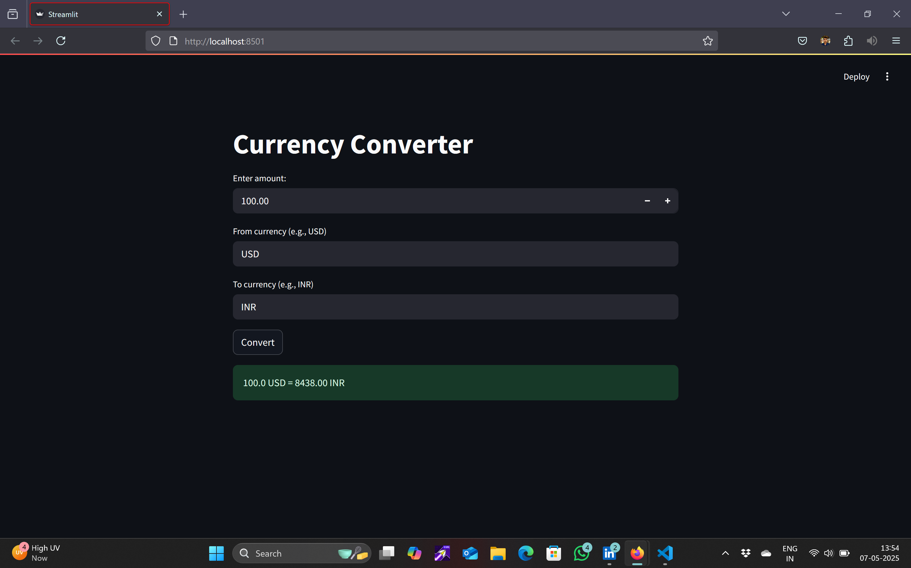

# Currency Converter (Streamlit App)

A simple and interactive Currency Converter app built using **Python** and **Streamlit**. It uses the [Frankfurter API](https://www.frankfurter.app/) to fetch real-time exchange rates and convert any amount between supported currencies.

---

## 📸 Screenshot



---

## 🚀 Features

- 🔁 Real-time currency conversion
- ✅ Beginner-friendly and clean UI
- 🌍 No API key required
- 💻 Built with Python + Streamlit

---

## 🛠 Tech Stack

- Python
- Streamlit
- Requests
- Frankfurter API

---

## 📦 Installation

1. **Clone the repository**
   ```bash
   git clone https://github.com/Suryansh-101/currency-converter.git
   cd currency-converter

2. **Install dependencies**
   ```bash
   pip install streamlit requests

3. Run the app
  ```bash
   streamlit run currency_converter.py


